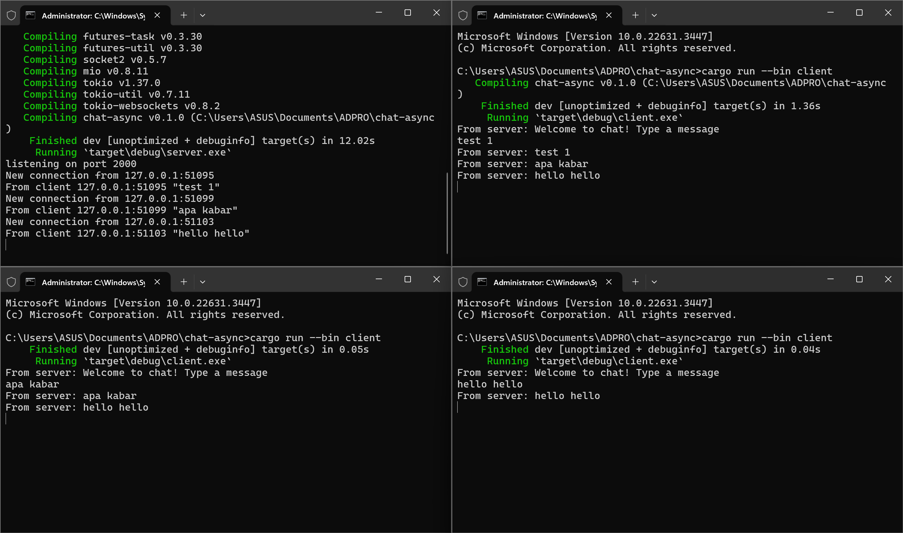
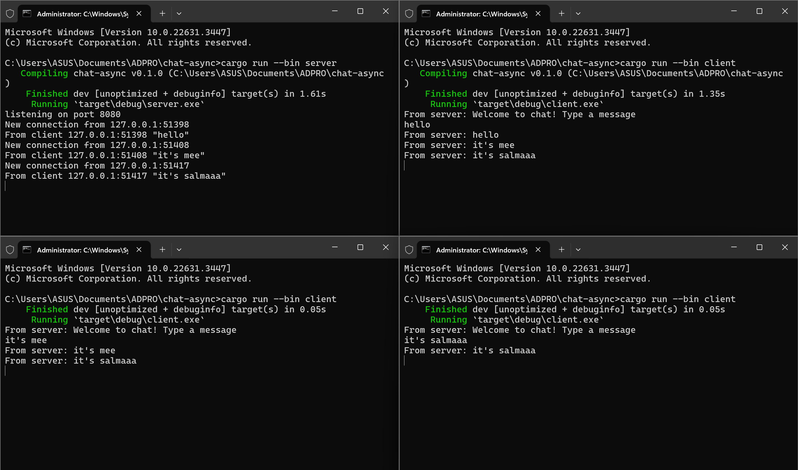
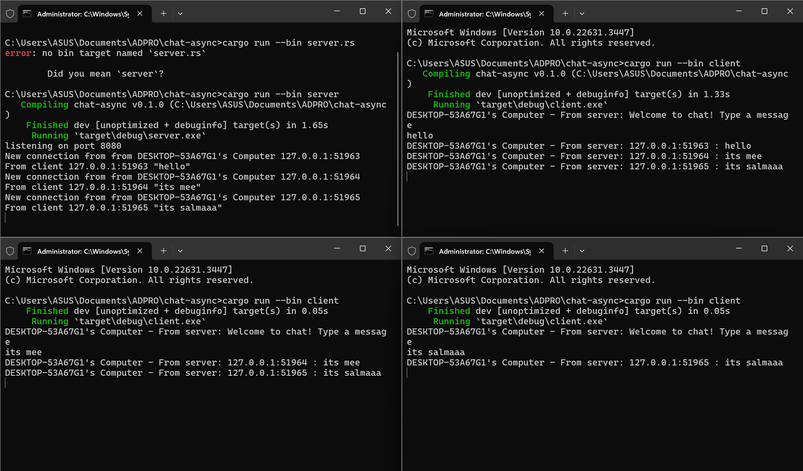

# Modul 10 Reflection
**Salma Kurnia Dewi (2206026681)** 

##  2.1: Original code, and how it run

In the displayed image, there are one server (in the left corner) and three clients (in the other three windows) on different terminals. The server is run using the command `cargo run --bin server`, while each client is run with `cargo run --bin client`. From the server window, it's evident that there are three connections from the three clients, each with different ports. When a message is inputted in one of the clients, the server broadcasts this message to the other clients.

##  2.2: Modifying the websocket port
**In the server file**

**In the client file**

To enable communication between the client and the server, both parts must be adjusted to use the same port. If the ports on the client and server differ, the client will not be able to connect to the server. In both files, the host for communication is determined in the main function. However, in server.rs, it appears not to use the Websocket protocol as there is no ws:// at the beginning of the URL in the listener. Additionally, the server uses TcpListener, indicating that the TCP protocol is being used.

**Cargo run**

##  2.3: Small changes, add IP and Port

In the depicted image, I've tested a server and clients by adding Hostname, IP, and port information. To obtain the Hostname, I used the `gethostname` package and added a variable `hostname = gethostname().into_string().unwrap_or_else(|_| "unknown".to_string());`, which is used in `println!` to display the Hostname. Additionally, I attempted to add sender information to each client by including my computer's host name using the `gethostname` dependency. This dependency was then used to modify the print command on the server and clients, resulting in the running program as seen in the image.